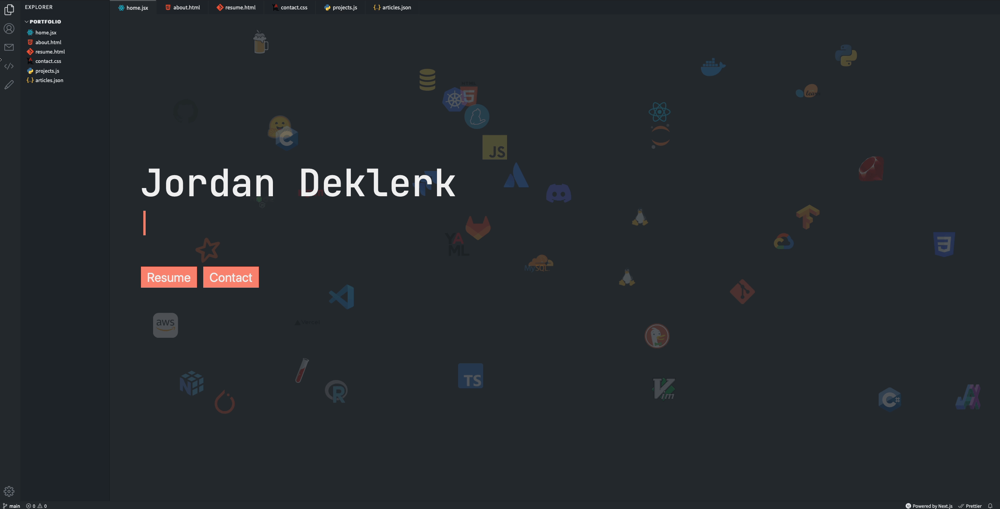

# vscode-portfolio

A Visual Studio Code themed developer portfolio website built with Next.js and deployed on Vercel.



## Running Development Server

```bash
npm run dev
# or
yarn dev
```

Open [http://localhost:3000](http://localhost:3000) with your browser to see the result.

All VSCode related components can be found in the `components` folder. To change the content of the portfolio, check out the `pages` folder. To add or remove pages, modify `components/Sidebar.jsx` and `components/Tabsbar.jsx`.
